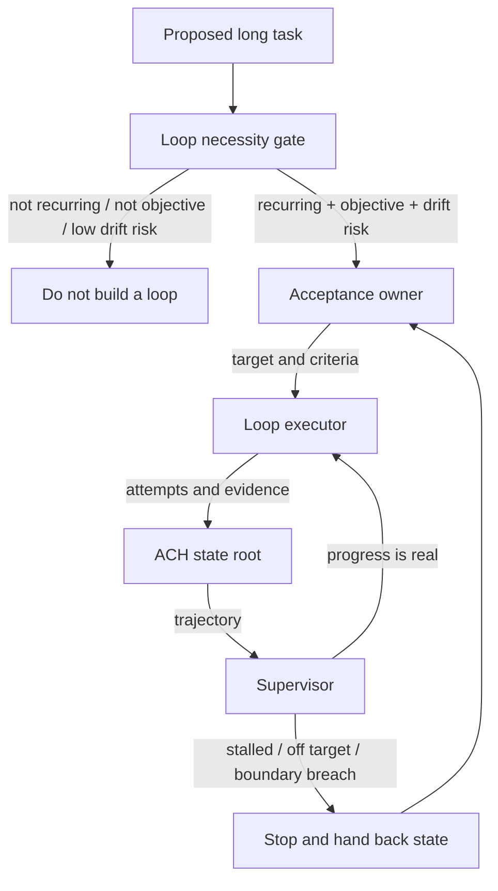

<!-- Language switch -->
**English** | [中文](./README.zh.md)

# loop-builder

**Design autonomous loops that can converge, prove progress, and stop.**

An autonomous loop is dangerous when it keeps acting without an independent way to judge whether it is getting closer to the target. `loop-builder` decides whether a task deserves a loop at all, then defines the smallest governance structure that can keep the loop honest.

It does not store continuity state. [ACH](https://github.com/bagbag16/agent-continuity-harness) handles state, recovery, and handoff. `loop-builder` handles the semantic governance: objective acceptance, independent supervision, and stop conditions.



## The Necessity Gate

Build a loop only when all three are true:

1. The task recurs or needs many autonomous attempts.
2. Success can be judged by objective acceptance criteria.
3. Drift, stalling, or self-justification is a real risk.

If any condition fails, use a normal plan instead of a loop.

## Governance Roles

| Role | Responsibility |
| --- | --- |
| Acceptance owner | Defines the target, criteria, and next target after success |
| Loop executor | Attempts the work and records evidence |
| Supervisor | Has authority to stop, redirect, or challenge the loop |
| [ACH state root](https://github.com/bagbag16/agent-continuity-harness) | Stores continuity state so the loop can resume without drift |

The supervisor must outrank the executor. A loop that judges itself will eventually excuse itself.

## Quick Start

Install as an agent skill (Claude Code, Codex, or any client that reads `SKILL.md`):

```bash
# Claude Code
git clone https://github.com/bagbag16/loop-builder.git ~/.claude/skills/loop-builder
# Codex
git clone https://github.com/bagbag16/loop-builder.git ~/.codex/skills/loop-builder
```

Then ask:

```text
Use loop-builder. Decide whether this task should become an autonomous loop. If yes, define the acceptance criteria, executor, supervisor, stop conditions, and ACH state boundary.
```

A complete design session — necessity gate, the three roles instantiated, the acceptance table, ACH binding, thresholds, and a supervisor trip in action — is in the [worked example](./EXAMPLE.md) (Chinese, like [SKILL.md](./SKILL.md), which is the authoritative methodology).

## Enforcement Levels

A governance rule the executor can talk its way past is not governance. loop-builder splits its mechanisms by how they are actually enforced — the design stance is that **counting belongs to code, judgment belongs to agents**:

| Mechanism | Level | Enforced by |
| --- | --- | --- |
| Rounds, budget, stall tripwire (K), distance window (W), legal exits | **gate** | host-code loop shell — see the [reference implementation](./reference/loop-shell.workflow.js); the executor cannot negotiate with an `if` statement |
| Acceptance distance measurement | **derived** | computed by the shell from per-criterion status the executor must return; self-reported classification is only ever used to stop *earlier* |
| Judge information asymmetry | **gate** | the orchestrator hands the judge only {artifact, spec} — it physically never receives the execution transcript |
| Judge independence | **prose → gate** | SKILL.md now requires a different base model by default; enforceable wherever the orchestrator controls model selection |
| Necessity gate, acceptance co-design, semantic stall diagnosis | **prose** | design-time method and semantic judgment — inherently prose, stated as such |

## When Not To Use It

Do not use it for ordinary long tasks, one-off research, vague goals, or work that cannot be objectively judged. More process does not make an unclear goal clearer.

## License

MIT.
