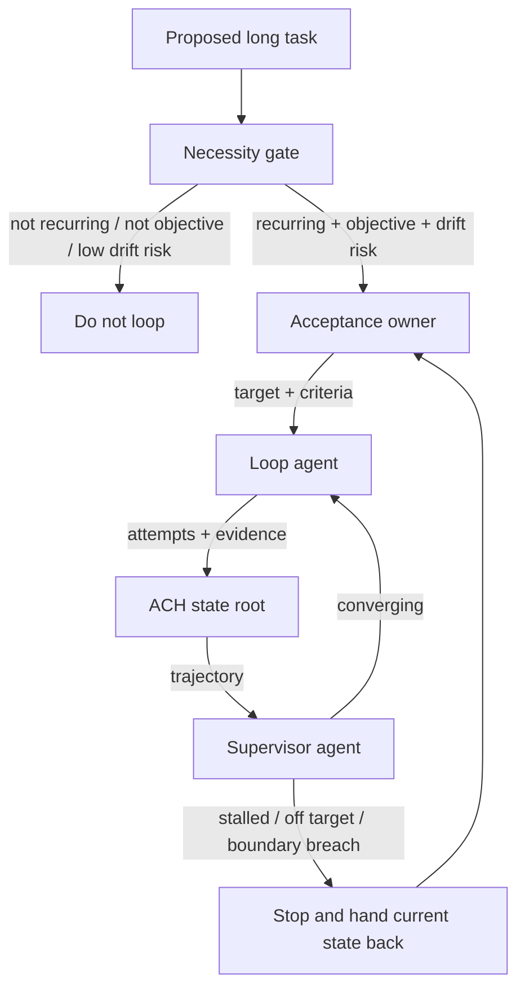

<!-- Language switch -->
**English** | [中文](./README.zh.md)

# loop-builder

**Governance for autonomous loops that should converge, stop, and be judged independently.**

Long-running AI loops do not usually fail because they cannot take another
step. They fail because the loop keeps moving without proving that it is moving
toward the acceptance target. Attempts multiply, direction changes feel like
progress, and the same agent that executes the work quietly becomes the agent
that excuses the work.

`loop-builder` is the layer that decides whether a task deserves loop structure
at all, then designs the smallest governance model that can keep it honest. It
does not store state itself. State, recovery, and handoff belong to `ach`;
`loop-builder` adds the semantic governance that ACH intentionally does not
own.



> **Design stance:** a loop is justified only when it prevents a real failure
> mode. Extra roles, checks, or documents are waste unless they make the loop
> more objectively judgeable or easier to stop.

<details>
<summary>Table of contents</summary>

- [The problem](#the-problem)
- [Why this exists](#why-this-exists)
- [How it works](#how-it-works)
- [Quick start](#quick-start)
- [Core concepts](#core-concepts)
- [When to use it - and when not to](#when-to-use-it---and-when-not-to)
- [Relationship to ACH](#relationship-to-ach)

</details>

---

## The problem

Autonomous loops are attractive because they promise self-propelled work. The
failure mode is that "self-propelled" becomes "self-justifying":

- the task repeats actions without reducing the distance to acceptance;
- the executor changes direction and treats the change as progress;
- soft goals stay soft, so nobody can say whether the work is done;
- the same role executes, evaluates, and silently moves the target;
- state is recorded, but no independent role judges convergence.

`loop-builder` targets this narrow governance problem. It is not a general
agent framework and it is not a persistence layer.

## Why this exists

The first question is not "how do we automate this?" The first question is:

> *Is this task worth becoming a loop, and what failure would the loop prevent?*

If the task is one-shot, the next step is obvious, or acceptance cannot be made
objective enough to judge, a loop adds ceremony without control. If the task is
repeated, drift-prone, and independently judgeable, a loop needs a small
governance structure before it needs more automation.

## How it works

`loop-builder` starts with a necessity gate:

1. Will the task repeat?
2. Can acceptance be defined objectively enough to judge?
3. Is there a real risk of drift, empty motion, or false completion?

Only when all three are true does it design a loop.

The loop uses three roles:

| Role | Owns | Does not own |
| --- | --- | --- |
| Loop agent | execution, observation, attempt classification | self-approval, target changes |
| Supervisor agent | convergence checks, stop decisions, boundary breaches | producing the deliverable |
| Acceptance and next-goal agent | acceptance criteria, final judgment, retargeting discipline | executing the work |

This split keeps the executor from grading its own output and keeps the
supervisor from becoming another producer.

## Quick start

Use the skill when designing a loop:

```text
Use loop-builder to decide whether this task should become an autonomous loop.
If yes, define the roles, acceptance criteria, stop conditions, and ACH state
handoff points.
```

Expected output:

- a necessity verdict: loop / do not loop / human-driven is enough;
- the minimum role structure;
- objective acceptance dimensions;
- stop conditions and supervisor triggers;
- the ACH state responsibilities the loop will rely on.

## Core concepts

| Concept | Meaning |
| --- | --- |
| Necessity gate | The three-question test before any loop is allowed |
| Acceptance owner | The role that defines and judges "done" |
| Supervisor | The role that detects non-convergence and stops execution |
| Semantic convergence | Whether attempts are reducing the distance to acceptance |
| No self-grading | The loop agent cannot approve or redefine its own goal |
| ACH dependency | State, recovery, and handoff are delegated to ACH |

## When to use it - and when not to

**Use `loop-builder` when you are thinking:**

- "This task should run for many rounds without me driving every step."
- "I need objective acceptance criteria before autonomy starts."
- "The loop may drift, churn, or falsely declare completion."
- "I need separate execution, supervision, and acceptance roles."

**Do not use it** for one-shot tasks, simple checklists, ordinary project plans,
or work where the next action is already clear and low-risk.

## Relationship to ACH

`loop-builder` depends on ACH but does not replace it.

| Layer | Responsibility |
| --- | --- |
| ACH | state root, recovery, handoff, drift guard, write-to-use closure |
| loop-builder | loop necessity, role governance, semantic convergence, stop rules |

In short: **ACH keeps the loop recoverable. `loop-builder` keeps the loop
governed.**
