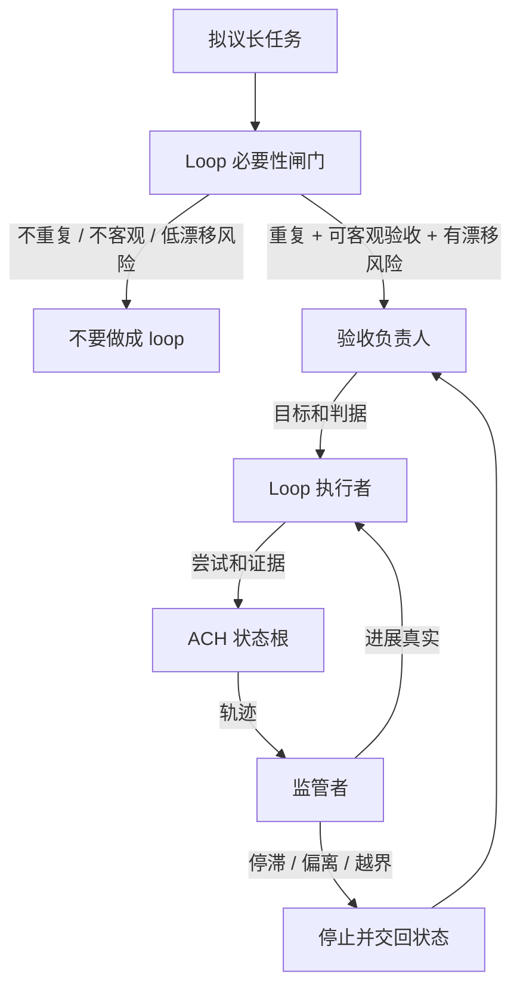

<!-- Language switch -->
[English](./README.md) | **中文**

# loop-builder

**设计能收敛、能证明进展、能及时停止的自治 loop。**

自治 loop 的危险不在于它不会继续行动，而在于它一直行动，却没有独立机制判断自己是否更接近目标。`loop-builder` 先判断任务是否值得 loop 化，再定义能让 loop 保持诚实的最小治理结构。

它不保存连续性状态。ACH 负责状态、恢复和交接；`loop-builder` 负责语义治理：客观验收、独立监管和停止条件。



## 必要性闸门

只有三件事同时成立，才值得做成 loop：

1. 任务会重复出现，或需要多轮自治尝试。
2. 成功可以用客观验收标准判断。
3. 漂移、空转或自我辩护是现实风险。

任一条件不成立，就用普通计划，不要设计 loop。

## 治理角色

| 角色 | 职责 |
| --- | --- |
| 验收负责人 | 定义目标、验收标准，以及成功后的新目标 |
| Loop 执行者 | 执行尝试并记录证据 |
| 监管者 | 有权叫停、重定向或质疑 loop |
| ACH 状态根 | 保存连续性状态，避免恢复时漂移 |

监管者必须高于执行者。自己验收自己的 loop，最终会替自己找理由。

## 快速开始

```text
Use loop-builder. Decide whether this task should become an autonomous loop. If yes, define the acceptance criteria, executor, supervisor, stop conditions, and ACH state boundary.
```

## 何时别用

普通长任务、一次性研究、目标含糊的工作，或无法客观验收的工作，不应该用它。更多流程不会让模糊目标自动变清楚。

## 许可证

MIT。
