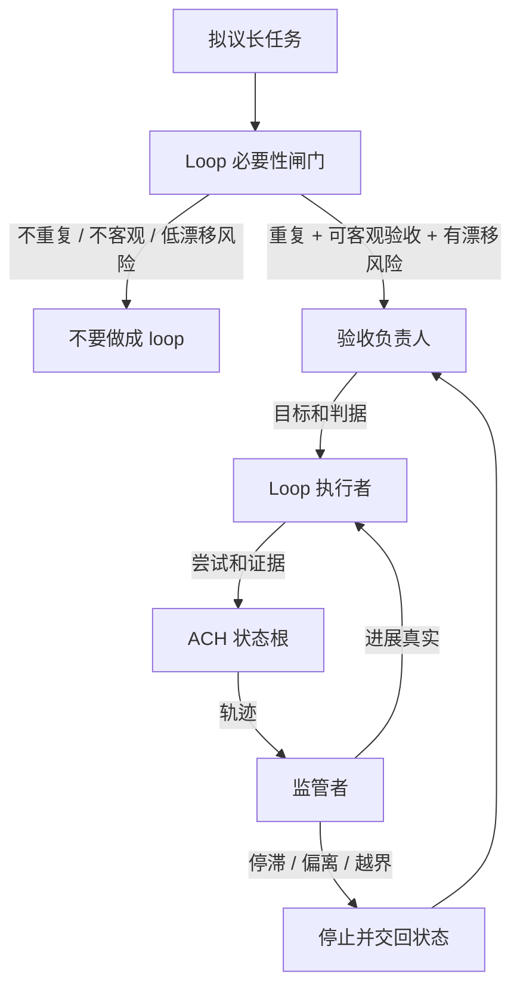

<!-- Language switch -->
[English](./README.md) | **中文**

# loop-builder

**设计能收敛、能证明进展、能及时停止的自治 loop。**

自治 loop 的危险不在于它不会继续行动，而在于它一直行动，却没有独立机制判断自己是否更接近目标。`loop-builder` 先判断任务是否值得 loop 化，再定义能让 loop 保持诚实的最小治理结构。

它不保存连续性状态。[ACH](https://github.com/bagbag16/agent-continuity-harness) 负责状态、恢复和交接；`loop-builder` 负责语义治理：客观验收、独立监管和停止条件。



## 必要性闸门

只有三件事同时成立，才值得做成 loop：

1. 任务会重复出现，或需要多轮自治尝试。
2. 成功可以用客观验收标准判断。
3. 漂移、空转或自我辩护是现实风险。

任一条件不成立，就用普通计划，不要设计 loop。

## 治理角色

| 角色 | 职责 |
| --- | --- |
| 验收负责人 | 定义目标、验收标准，以及成功后的新目标 |
| Loop 执行者 | 执行尝试并记录证据 |
| 监管者 | 有权叫停、重定向或质疑 loop |
| [ACH 状态根](https://github.com/bagbag16/agent-continuity-harness) | 保存连续性状态，避免恢复时漂移 |

监管者必须高于执行者。自己验收自己的 loop，最终会替自己找理由。

## 快速开始

作为 Agent skill 安装（Claude Code、Codex，或任何读取 `SKILL.md` 的客户端）：

```bash
# Claude Code
git clone https://github.com/bagbag16/loop-builder.git ~/.claude/skills/loop-builder
# Codex
git clone https://github.com/bagbag16/loop-builder.git ~/.codex/skills/loop-builder
```

然后这样要求：

```text
Use loop-builder. Decide whether this task should become an autonomous loop. If yes, define the acceptance criteria, executor, supervisor, stop conditions, and ACH state boundary.
```

一次完整的设计过程——必要性闸门、三角色实例化、验收标准表、ach 绑定、阈值，以及监管跳闸的实际一幕——见 [完整案例](./EXAMPLE.md)。权威方法论在 [SKILL.md](./SKILL.md)。

## 强制等级

执行者能讨价还价绕过的治理不是治理。loop-builder 把机制按真实强制方式分层——设计立场是**能数的交给代码,只有语义判断留给 agent**：

| 机制 | 等级 | 由什么强制 |
| --- | --- | --- |
| 轮数、预算、空转跳闸 K、距离窗口 W、三种合法退出 | **门禁** | 宿主代码循环骨架——见[参考实现](./reference/loop-shell.workflow.js)；执行者无法和一条 `if` 语句谈判 |
| 验收距离度量 | **结构化自报 → 推导** | 骨架从逐项判据状态计算——独立于归类标签,但数据仍由执行者提供,不是地面真相；由 `claims_done` 时的对抗式 judge 加固,可机械复验的判据应由骨架直接验 |
| judge 信息不对称 | **门禁** | 编排层只递【产物 + 规格】给 judge——它物理上收不到执行过程 |
| judge 独立性 | **散文 → 门禁** | SKILL.md 现要求默认换基座模型；凡编排层控制模型选择处即可机械保证 |
| 必要性闸门、验收共建、语义级空转诊断 | **散文** | 设计期方法与语义判断——本质上就是散文,如实标注 |

## 何时别用

普通长任务、一次性研究、目标含糊的工作，或无法客观验收的工作，不应该用它。更多流程不会让模糊目标自动变清楚。

## 许可证

MIT。
