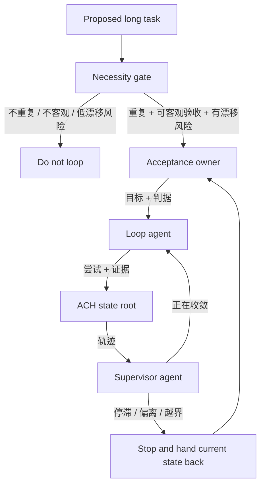

<!-- Language switch -->
[English](./README.md) | **中文**

# loop-builder

**为需要收敛、能自停、能被独立验收的自治 loop 设计治理结构。**

长时间运行的 AI loop 通常不是因为"下一步做不出来"而失败。它失败在:loop 一直在动,却
没有证明自己正在接近验收目标。尝试越来越多,换方向被误认为进展,而同一个执行 agent
悄悄变成了给自己放行的验收者。

`loop-builder` 先判断一个任务是否值得被 loop 化,再设计能让它保持诚实的最小治理模型。
它不自己存状态。状态、恢复和交接属于 `ach`;`loop-builder` 只补 ACH 刻意不持有的
语义治理层。



> **设计立场:** loop 只有在防住真实失败模式时才值得存在。额外角色、检查或文档,如果
> 不能让 loop 更可验收或更容易叫停,就是浪费。

<details>
<summary>目录</summary>

- [问题](#问题)
- [为什么有它](#为什么有它)
- [它怎么工作](#它怎么工作)
- [快速开始](#快速开始)
- [核心概念](#核心概念)
- [何时用、何时别用](#何时用何时别用)
- [与 ACH 的关系](#与-ach-的关系)
- [许可证](#许可证)

</details>

---

## 问题

自治 loop 很诱人,因为它承诺"自己往前跑"。真正的失败模式是"自己往前跑"变成"自己
证明自己没问题":

- 重复行动,但到验收目标的距离没有缩短;
- 执行者换了方向,并把换方向当成进展;
- 软目标一直是软目标,没人能裁定是否完成;
- 同一角色执行、验收,还悄悄移动目标;
- 状态被记录了,但没有独立角色判断是否收敛。

`loop-builder` 只处理这个窄治理问题。它不是通用 agent 框架,也不是持久化层。

## 为什么有它

第一个问题不是"怎么自动化这件事?"。第一个问题是:

> *这件事值得做成 loop 吗,这个 loop 要防住哪个失败?*

如果任务是一次性的、下一步显然、或验收无法客观化,loop 只会增加仪式感,不会增加控制。
如果任务会重复、容易漂、且能被独立验收,那在增加自动化前,先需要一个小治理结构。

## 它怎么工作

`loop-builder` 从必要性闸开始:

1. 任务会重复吗?
2. 验收能否客观到足以裁定?
3. 是否真的有漂移、空转或假性完成风险?

三个问题都为真,才设计 loop。

loop 使用三个角色:

| 角色 | 持有什么 | 不持有什么 |
| --- | --- | --- |
| Loop agent | 执行、观察、尝试归类 | 自我批准、目标变更 |
| Supervisor agent | 收敛性检查、叫停决定、边界违背判断 | 生产交付物 |
| Acceptance and next-goal agent | 验收标准、最终裁定、重定向纪律 | 执行工作 |

这个拆分避免执行者给自己打分,也避免监管者变成另一个生产者。

## 快速开始

设计 loop 时使用:

```text
Use loop-builder to decide whether this task should become an autonomous loop.
If yes, define the roles, acceptance criteria, stop conditions, and ACH state
handoff points.
```

预期产出:

- 必要性结论:loop / 不 loop / 人工推进足够;
- 最小角色结构;
- 客观验收维度;
- 停止条件和 supervisor 触发器;
- loop 依赖的 ACH 状态职责。

## 核心概念

| 概念 | 含义 |
| --- | --- |
| Necessity gate | 允许 loop 出现前的三问 |
| Acceptance owner | 定义并裁定"完成"的角色 |
| Supervisor | 检测不收敛并叫停执行的角色 |
| Semantic convergence | 尝试是否正在缩短到验收的距离 |
| No self-grading | loop agent 不能批准或重定义自己的目标 |
| ACH dependency | 状态、恢复和交接交给 ACH |

## 何时用、何时别用

**当你在想这些时,用 `loop-builder`:**

- "这件事要跑很多轮,不能每一步都靠我驾驶。"
- "自治开始前,我需要客观验收标准。"
- "这个 loop 可能会漂、空转或假性完成。"
- "我需要分开执行、监管和验收角色。"

**不要用它** 处理一次性任务、简单清单、普通项目计划,或下一步已经清楚且低风险的工作。

## 与 ACH 的关系

`loop-builder` 依赖 ACH,但不替代 ACH。

| 层 | 职责 |
| --- | --- |
| ACH | 状态根、恢复、交接、漂移护栏、write-to-use 闭合 |
| loop-builder | loop 必要性、角色治理、语义收敛、叫停规则 |

一句话: **ACH 让 loop 可恢复。`loop-builder` 让 loop 有治理。**

## 许可证

MIT。
