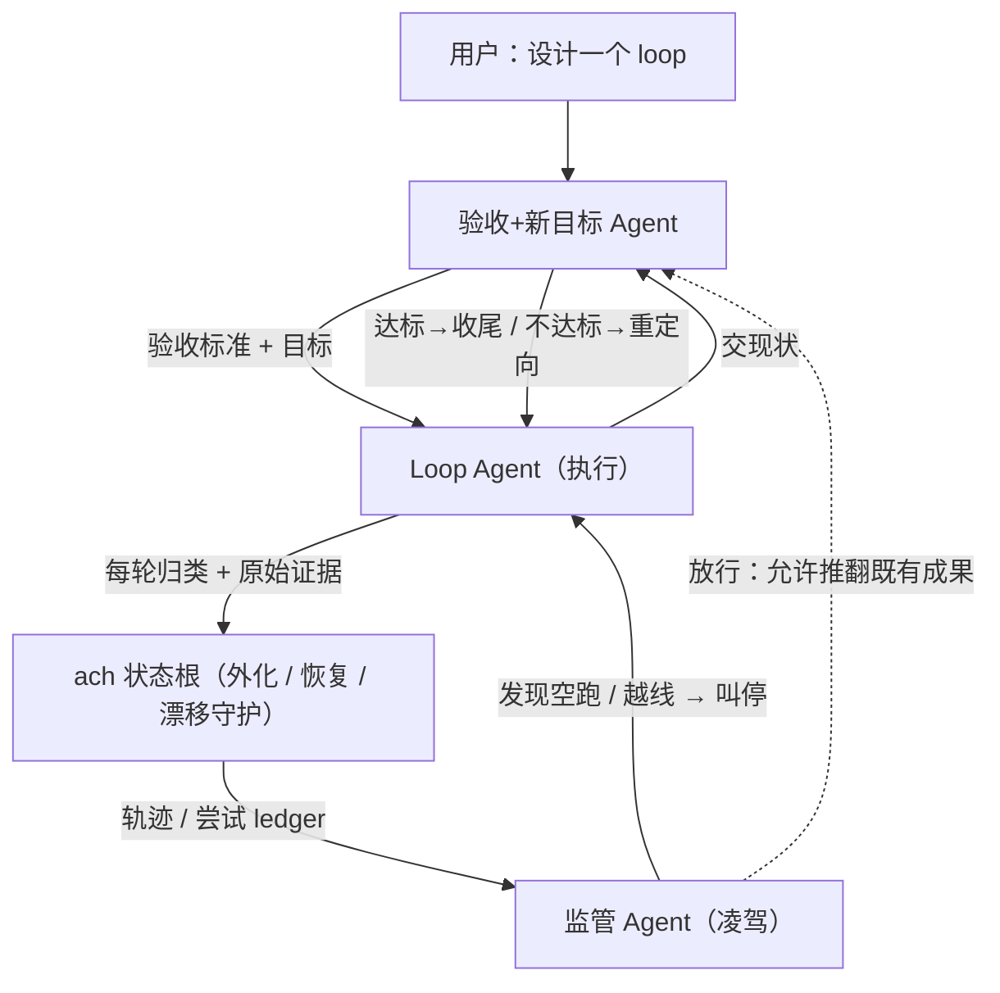

# loop-builder

**设计**一个自治 loop:它的验收标准、它的三角色治理、它的刹车与边界。
不是教你跑一个循环,而是先把一个会跑偏、会空转、会假性完成的长任务,
装配成一个**能被独立验收、监管能止损、能自己停**的闭环。

外化 / 恢复 / 漂移守护**全部交给 `ach`**(= [Agent Continuity Harness](https://github.com/bagbag16/agent-continuity-harness),长任务状态外化与恢复工具;分工细节见下文"ach 管什么"一节)——本 skill 只补 ach 结构上管不到的语义级治理。

---

## 何时触发 / 何时不

- **触发**:用户要"设计一个 loop / 把某长任务做成自治闭环 / 给 loop 定验收标准"。
- **不触发**:一次性任务、简单清单、只是嘴上提到"loop"。直说"这事不值得 loop 化"。

> 命名说明:本文用 Ring 编号标记 loop 的圈层,数字越大越靠内圈——**Ring -1** = 开局必要性闸门(loop 外),**Ring 0** = 契约(目标/验收/红线/预算),**Ring 1** = 单轮内循环,**Ring 2** = 单轮结果归类与下一步。

**Ring -1 · 必要性闸(开局第一步)**:三问——
① 会重复吗? ② 验收标准**能否被**客观定义(软目标先用下文"验收目标共建"拆维度试着落地,落得下来就算"能")? ③ 会跑偏 / 会空转吗?
三个都"是"才做成 loop;否则人肉驾驶更省,直接说明并退出。

---

## 设计法则(先于一切,贯穿全程)

1. **第一性原理**:每个环节 / 角色 / 验收条目都必须能回答"它防住哪个**真实**失败模式"。答不出 → 删。
2. **奥卡姆剃刀**:不为次要目标增加结构;不保留无实际价值的冗余。
3. **主次不倒置**:次要目标不得损害主要目标。冲突时牺牲低必要性者,**且必须显式声明**(见"验收标准设计")。

---

## 三角色治理架构(本 skill 的核心产出)

| 角色 | 职责 | 不做什么 | 凭什么独立 |
|---|---|---|---|
| **Loop Agent(执行)** | 跑 Ring 0/1/2:感知→决策→行动→观察→**归类** | 不自评"够不够好";不自己改目标 | —— |
| **监管 Agent(凌驾)** | 读 ach 外化的轨迹,catch ach 管不到的语义失败:**轨迹在动但不收敛于验收标准**(无限换向空跑)、越红线、主次倒置。trip 即**叫停**执行,令其交现状 | 不生产成果;不定验收标准 | 不参与执行,才看得清"在原地打转" |
| **验收+新目标 Agent** | 设计/持有验收标准;被叫起时裁定"当前部分成果是否达标"+"是否需要重新定向";改目标时执行"不浪费前功"纪律 | 不执行;不在没被触发时干预 | 不执行,才不会给自己放水 |

**层级:监管 > {执行, 验收}**。监管不产出成果,只裁定"继续 / 叫停"。

---

## 分工:ach 管什么,监管 Agent 管什么(关键)

> **先接入 ach,别自造存储。** `ach` 是本 harness 里既有的状态续连 skill——设计 loop 前**先把 ach 当 skill 调起**(用户说"设计 loop"时它就该被一并触发),由 **ach 自己**建 / 绑状态根、给出真实字段;**本文件不复制 ach 的 schema**(那会随 ach 漂移)。下文带反引号的 `current-goal` / `confirmed-constraints` / `branch-attempt-ledger` / `decisions` 只是**示意 ach 大致有这些槽位**,真实字段名**以 ach 实际输出为准**,没有对应就用就近字段,**绝不另起一套存储**。若环境里确无 ach,退化为"在一个固定文档里维护这些槽位",但仍**不要发明新存储协议**。

- **ach 管(按 ach 执行即可)**:Charter / 迭代 ledger / decisions 的外化、跨窗恢复、漂移守护、状态关系。
  Loop Agent 的目标、约束、每轮归类与证据,**都落进 ach 状态根**,不另造一套存储格式(Occam)。
- **监管 Agent 管(ach 结构上做不到的)**:对 ach 存下来的轨迹做**语义判断**——尤其"尝试在变多、状态在变,但没有任何一条朝验收标准收敛"。
  监管以 ach 的 `branch-attempt-ledger` 为感知底座,做**收敛性裁决**;一旦判定空跑,强制执行 Agent 把现状交给验收+新目标 Agent 衡量。

> **边界(别重复造):** ach 的"漂移守护"守的是**状态完整性**(状态会不会过期、还恢复得了吗);监管 Agent 守的是**语义收敛**(工作有没有在原地打转)。两层不重叠——**ach 不判方向,监管不存状态**。

### 监管的不收敛信号(怎么判定"在空跑")

命中任一即叫停。三个信号从不同角度抓停滞,不是同一测量的复述:

- **核心 · 验收距离不减**:最近 W 轮内,**到验收的"距离"没缩小**。"距离"按判据类型取:布尔型数"还差几条未满足";连续 / 逼近型(如延迟降到 T)与维持型(如吞吐 ≥ 基线)则取**剩余差距 / 是否在退化**(基线 / 目标值从 Charter 取)。数据来自执行 Agent 每轮落进 ledger 的逐项判据状态(见交接协议),是**独立真测量**——专抓"自称前进、实则没碰要紧判据"的进展表演。
- **廉价跳闸 · 停滞计数**:连续 K 轮被归类为 ②空转。它**信任执行的自报标签**(便宜、早);核心信号则**不信标签、直接验距离**——一个测自报、一个测实情,故不冗余。
- **同层打转**:ledger 里多条"不同方向"的尝试,其实共享同一个**已被否决的根假设**;或在两个互相牵制的目标间反复对冲(顾此失彼、净距离不减)。抓"换了方向、同一个死胡同"。

(W、K 是两个不同的量,完整定义见交付物 #5。)

---

## 三角色交接协议(最小集)

第一性:耐久内容已全在 ach,角色间只需传**最小瞬时控制信号**,且其理由写回 ach `decisions`。**不另建消息总线。**

| 交接 | 触发 | 传什么(最小) | 落 ach |
|---|---|---|---|
| 验收 → 执行 | 开局 / 重定向后 | Charter(目标 + 验收表 + 预算 + 红线) | current-goal, confirmed-constraints |
| 执行 → ach | 每轮 | 归类 + 原始证据 + **每条 P0 判据的满足/未满足** | branch-attempt-ledger |
| 监管 → 执行 | 跳闸 | { 停, 命中的信号, 原因 } | decisions |
| 执行 → 验收 | 被叫停 / 自报完成 | 现状快照(已/未满足判据 + ledger 摘要) | —— |
| 验收 → 执行 | 裁决后 | { 达标→收尾 / 不达标→新瞄向或精修判据 / 放弃 } + 牺牲声明 | decisions, current-goal |
| 监管 ⇢ 验收 | 需推翻前功 | { 放行, 原因 } | decisions |

---

## 验收目标共建 + 标准设计(验收 Agent 主持,开局必做 · req 1/2/3)

**"好不好"不靠 agent 自己拍、也不靠人每轮点头——开局就和用户把"好"谈成一份客观规格**,之后 loop 自主对照它跑。开局四步:

1. **定义对象**:这产物是什么、面向哪些使用者 / 情况、成功后带来什么改变。
2. **拆维度 + 程度**:把"好"拆成可量维度(**别从零发明,从下方种子清单裁剪**),每维度定一个达标**程度 / 阈值**(给数字 / 例子 / 参照物,SMART 化)。
3. **借鉴**:某维度的"标杆"在哪拿不准时,先找同类产物 / 公认标准对标,别闭门定线。
4. **定必要性 + 确认**:给每维度定级——**P0 = 破坏核心体验 且 高触发率**(反向法:"什么问题你会直接拒收?");非 P0 再按**类型**排序:**阻塞 > 使用体验 > UI 体验**(阻塞类通常更高)。**别让维度全是 P0**(全 P0 = 没排序)。与用户确认后,这份规格 = loop 的**最终验收目标**;之后只有"有理(新约束 / 新信息)且不违背设计理念"才可改,走"目标变更纪律"、留痕,默认不动。

**维度种子清单**(领域无关,按产物类型裁剪 · 取自 ISO 25010 / Kano / Wang-Strong / Nielsen):
- **通用**:功能完整、正确、相关、清晰可理解、一致、可访问、及时
- **软件 +**:性能、安全、可靠、可维护、兼容
- **文档 / 内容 +**:客观可信、简洁、结构可读、风格合规
- **设计 / 交互 +**:可学习、效率、错误可恢复、满意度

**程度怎么定**(防"列了维度却没说多好算够"):**底线型**维度(达到即可、超了无加分)设 pass/fail 线;**梯度型**(越好越满意)设目标值 + 可接受下限。够好即停,不追完美。

成果落成三元组——每条 = **{ 可独立验证的事实 , 必要性等级 P0/P1/P2 , 它防住哪个失败 }**:

- **有实际意义**:不可验证 / 凑数的条目直接删(Occam);"它防住哪个失败"答不出的也删(第一性)。
- **验收按"客观性递减"降级**(核心:别让干活的自己判好不好——纯语言自评会系统性拉低质量):
  ① 能转成**可执行断言**(测试 / schema / 返回码 / 重跑)就机械验——最可靠、与模型无关;
  ② 验不了才上**独立 judge**:只喂【产物 + 验收规格】、不喂执行过程,用**对抗式 prompt**(找哪条不达标、默认有罪);靠不住的可"代理判据 + 抽样 / 人评",**纯主观 / 高风险判据再换个模型验**(避自偏好 bias;本 harness 用 Agent 的 model 参数或 orca 换 agent 类型);
  ③ 终检再加 **holdout**(没见过的样本)复核,防针对可见验收集刷分(详见"终止")。
  全程拿不到任何验证手段 → 按 ④受阻**升级**,**绝不假装该判据已满足**。
- **必要性优先**:先满足 P0,再 P1、P2。资源紧时 P2 可不满足。
- **冲突处理**:允许牺牲低必要性满足高必要性,但**必须在交付里显式声明**——
  "为满足 X(P0)牺牲了 Y(P2),因为 ……"。**沉默地丢掉一条验收 = 违规。**
- **目标型 vs 约束型**(防"目标全是 P0、无法排序"):**要去达到**的写成验收项(按 P0/P1/P2 分级);**不许破的下限 / 边界**(如"吞吐不得低于基线""成本不得超 C")写成**红线**,不进可牺牲的验收表。多数"牵制"就此拆成"一个推进目标 + 若干红线",自然可排序。
- **同级真冲突**:若两个**目标型 P0** 确实无法同时满足(纯牵制),验收 Agent **不得私自降级其一**——优先级是用户的决定:回 Charter 取显式优先级,没有就当 ④受阻**升级给用户**(自行牺牲一个 P0 = 偷改目标)。

---

## 目标变更纪律(req 6)

loop 的目标方向**不一定孤立**,可能与其他设定 / 既有成果关联。

- 改目标或重新定向**前**,验收 Agent 必须检查:新目标会不会让既有成果作废?
- **默认不浪费前功**。确需推翻既有成果 → **只有监管 Agent 放行**才可,且把理由记进 ach `decisions`。

---

## Loop Agent 的内循环(精简,外化走 ach)

- **Ring 0 契约**(开局,外化进 ach):目标 / 验收标准(来自开局"验收目标共建")/ 红线 / 预算。
  预算含**停滞预算**:连续 K 轮被归类为 ②空转即触发监管裁决(③倒退 / ④受阻不计入——受阻是合理等待,不是空跑)。
- **Ring 1 单轮**:感知(实读 ach 状态)→ 决策(**单一最小动作**,先过红线)→ 行动 → 观察(留**原始证据**)→ 归类。
- **Ring 2 六态归类 + 确定下一步**:

  | 结果 | 下一步 |
  |---|---|
  | ① 前进 | 固化 → 记 ach → 下一动作 |
  | ② 空转 | **换 {方法/信息/范围} 至少一项**,禁止原样重试;计入停滞预算 |
  | ③ 倒退 | 回滚到上一个好状态,再决策 |
  | ④ 受阻 | 升级 / 取信息后回到感知 |
  | ⑤ 完成 | 执行自测 P0 看似全绿 → **上交验收 Agent 裁定**(执行只触发、不自裁,裁定权在验收) |
  | ⑥ 耗尽 | 停,交验收 Agent 出"放弃 / 部分达标"结论 |

  判不出 ① 还是 ② → 默认按 ②(防假性进展)。

---

## 终止(三种合法退出,均由验收 Agent 裁定,给用户明确交代)

- **完成**:P0 全满足 + **终检**(验收独立重跑验证一次,**含 agent 未见过的 holdout 样本**——防针对可见验收集刷分;"稳定 / 不回归"类判据需连跑数次确认)通过 → 交付。P1 / P2 未满足**不阻塞完成**,但必须在交付声明里列为"已知牺牲"(对应"冲突处理")。
- **放弃**:当前约束下目标不可达 → 说清卡在哪、需要什么。
- **耗尽**:预算 / 停滞预算用光 → 报告进度、已产出、缺口。

绝不"悄悄停下"或"假装完成"。

---

## 预期效果(成功长什么样)

设计出的 loop 在运行时应满足四条可观测保证——**不悄悄完成、不无限空跑、不白费前功、不沉默丢判据**(即上面四个机制的运行时体现)。这四条就是验收"本 skill 输出"的客观标准。

---

## 运行本 skill 的交付物

1. **Ring -1 结论**:该不该做成 loop(不该就停)。
2. **三角色实例化**:执行 / 监管 / 验收**两两独立**,不可一个 agent 同时戴两顶帽子(本 harness 下用独立子代理 Agent / orca worker 实现)。理由:执行不能自评、验收不能给自己放水、监管要中立旁观才看得清空转。
3. **验收标准表**:开局与用户共建、维度化(+ 达标程度)、必要性分级 + 冲突声明。
4. **ach 外化绑定**:Charter / ledger / decisions 落到哪个 ach 状态根。
5. **阈值**:**K**=连续空转计数(取 2–5,单轮越贵越小);**W**=验收距离窗口(可同 K,或更长以平滑抖动);**红线 / 预算的单位**(轮数 / 时间 / 成本,择一为主);"稳定类"判据的连跑次数与跨度。
